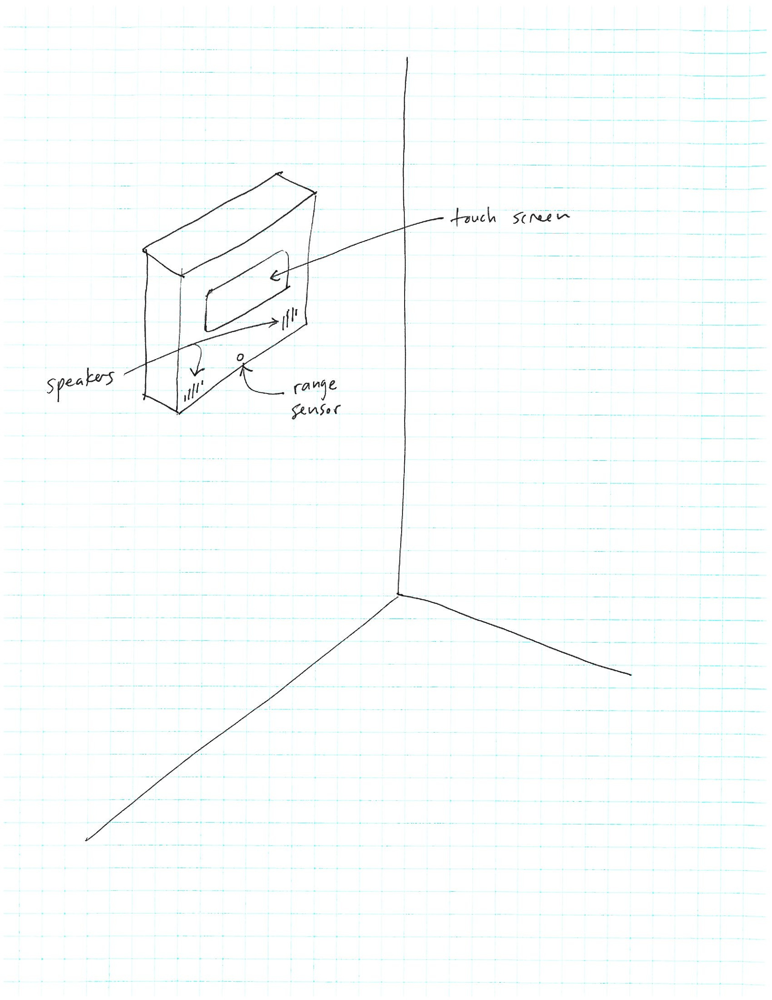

**Due**: Tuesday, Sept 12th by 11:59 PM

In this assignment you will propose an idea for a team project.  First, read the **Concept** section, which describes the concept for the team project.  Next, read the **Requirements** section, which describes the requirements for the team project.  Finally, read the **Deliverable** section, which explains what information you should include in your team's proposal.

Please submit your proposal according to the instructions in the **Submitting** section.

# Concept

Your team will be creating an interactive computing installation.

The installation will contain an embedded computer, a small touchscreen, speakers, and sensors and actuators.

Your installation should allow people to *interact*.  This means that the system you create (software and hardware) should sense the physical environment and respond in some way.  The system should include the following elements:

* A physical enclosure
* Animation (to be displayed on the touchscreen)
* Music or sound (you can compose music or use pre-recorded sounds)
* Sensors to sense the user and/or the physical environment: the animation, sound, and/or actuators should respond to sensor input
* Actuators such as LEDs and servo motors

## Example

Here is a sketch of an example installation (click for full size):

> 

This (example) installation will be mounted in a box attached to the wall.  The theme of the installation is water.  The touchscreen displays a simulated water animation, and the speakers play the sound of running water.  The range sensor detects when a person approaches the installation, and when someone approaches the sound volume increases, and blue LEDs start pulsing with an intensity proportional to the user's proximity.  When the user touches the touchscreen, a ripple animation is displayed centered on the point where the user touched, and a "plunk" sound plays.

## Available sensors

TODO: description of sensors available (link to friendly datasheets)

# Requirements

The requirements for the team project are as follows.

Your team needs to have 2 or 3 members.

Your installation must use the embedded computer and touchscreen to display an animation and produce sound.

Your installation must include at least one sensor (in addition to the touchscreen's touch sensor) to sense the physical environment.

Your installation must include at least one actuator (in addition to the touchscreen display and speakers).

The installation must support some type of *interaction*, meaning the behavior of the system changes based on the activity of a person uses the system.

Be creative!  Try to come up with a concept that is simple, but offers an interesting interactive experience.  Also, it's not a bad idea to discuss possible ideas with us (the instructors): we can help give you a sense of how feasible your idea is to implement.

# Deliverable

The deliverable for the assignment is a 2-3 page proposal with the following information:

* Who the team members are
* A description of how the installation reacts to people and the physical environment
* What animations and sounds the installation offers
* What sensors the installation uses to sense people and the physical environment
* What actuators the installation uses to display information and interact with people
* A sketch of the how the installation is put together, including a physical enclosure

# Submitting

*One member of your group* should create a document in his or her shared google drive folder called `Project Proposal`.
