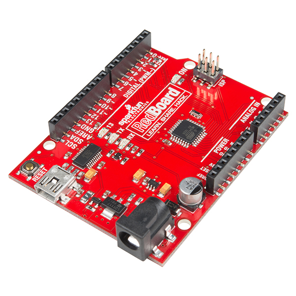
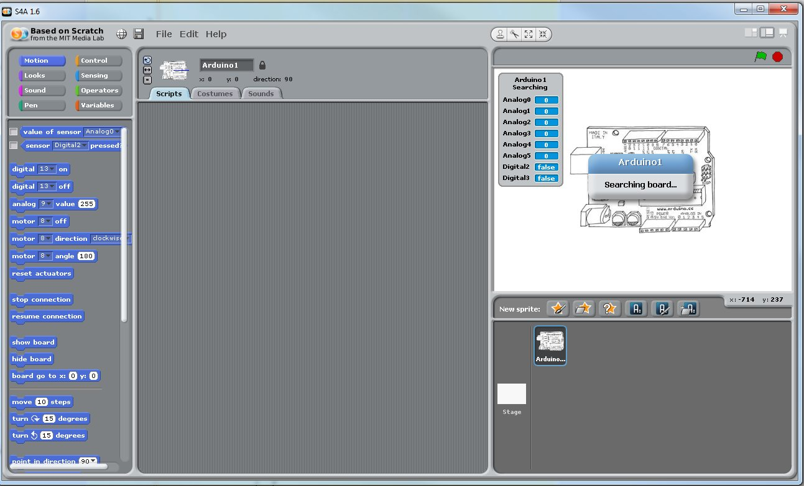
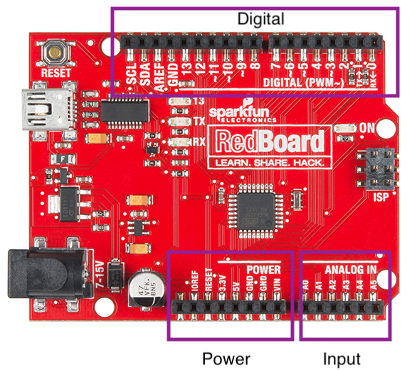
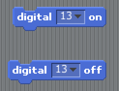
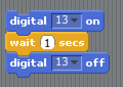
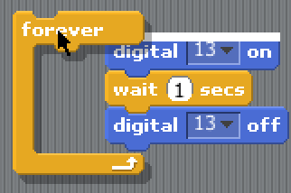

# Learning goals
* Utilize Scratch4Arduino (S4a) to interface with external sensors and actuators
* Describe the purpose/use of simple sensors such as a photocell, pressure sensor, and range finder.
* Describe the purpose/use of simple actuators such as an LED, servo, and motor.

# What to do

[comment]: 

## Part 1: Getting Started with Scratch
[Scratch](https://scratch.mit.edu) is a simple block-based programming language. If you can snap lego blocks together, then you can create a Scratch program. In this course we will use a variation of Scratch called [Scratch4Arduino](http://s4a.cat) (S4A). This modification allows Scratch to interface with external sensors.

In writing your programs you will need several things:
* An Arduino (see Figure 1)
* A USB cable to connect your Arduino to your PC
* The Scratch4Arduino software (already installed on your computer)

<b>Step #1</b> Connect your Arduino your PC via the USB cable.

<b>Step #2</b> Launch the s4a program from your desktop. You can do this by clicking on the Start Menu and then typing in "s4a". An icon should appear like below.

>

<b>Step #3</b> Scratch should launch and begin searching for your Arduino as shown below. Once the message "Searching for Arduino" goes away you're connected to the board.

>

## Part 2: Getting to Know Your Arduino (Inputs and Outputs)
Before working with your Arduino you should get to know the various interfaces and pins that are available on the system. General purpose input/output (I/O) pins are the way in which your Arduino communicates with the outside world. There is no mouse, keyboard, monitor...etc that its uses to reading or produce information. These pins can either be <i>inputs</i> or <i>outputs</i>. An <i>input</i> pin brings information into the Arduino, while an <i>output</i> pin produces information or controls some other device.

>
(Copyright SparkFun CC 2.0)

All of the I/O pins on the Arduino are located within three groups: <b>Digital Input/Output</b>, <b>Analog Input</b>, and <b>Power</b>. 

<i>Digital Input/Output</i> pins read in or produce a signal that is either ON or OFF. That is, the signal is either full power or no power at all. This can be useful in turning on an LED (on/off) or determining whether a switch has been pressed (on/off). Some Digital I/O pins are special Pulse-Width Modulation (PWM) pins and can approximate an analog pin. These PWM pins are denoted by a (~) symbol near their number.

The <i>Analog Input</i> pins allows the Arduino to read in analog values from the outside work. Unlike a digital value which exists as either ON or OFF, an analog signal can take on a range of signals. For example, an analog signal might range from any voltage between 0V and 5V to indicate the force experienced by a sensor. These pins are only inputs, meaning they do not produce any values, and accept any signal with a voltage between 0V and 5V.

Finally, the <i>Power</i> pins draw from the electrical supply of the Arduino and enable you to power other sensors and actuators. It is extremely important to wire devices up correctly to the power ports. If performed improperly you can burn out the Arduino, a sensor, or even the USB port on your computer. To prevent any damage from occuring, here are some general rules to follow:
* As a safety precaution, always wire up any new sensors/actuators with the power disconnected. Then myself or Dr. Hovemeyer will be happy to check your wiring before powering up the board again.
* <b>Never connect a wire directly between 5V/3.3V and GND.</b> This creates a short-circuit and you could damage the board or injure yourself.
* For a given device, never switch the 5V/3.3V and GND connections. This is the same as wiring a device up backwards. While some sensors may tolerate this (resistor), others will immediately burn out (everything else).
* Overall, these rules are designed to make sure you don't let the "magic smoke" out. If you see or smell something burning, disconnect from your computer immediately.

## Part 3: Your First Program - Blinking a Light
The most important and easiest program to write on any microprocessor is turning on and off a light. If you can accomplish that then you can perform most any required operation. Take a look at the LEDs on your Arduino. Identify the one that has a number beside it (13). We will use our commands within Scratch to turn on/off digital pin #13.

### Simple Blinking
Within Scratch each block is grouped by colors and shapes. Blocks that "snap" together, work together, and each small stack of blocks is its own program. Within the "Motion" tab select the "Digital On" and "Digital Off" blocks. Grab each block and pull it to the canvas on the right.

> 

Click on the On button, what happens? Click on the Off button, what happens? You should see LED 13 on your Arduino turn ON and then OFF. If you do not see this effect, possibly you have the two blocks connected. Separate them. Consider why this does not produce the correct result. 	

### Your First Program
Consider all the work you would have to go through if you wanted a program that would blink a light forever. You would have to sit their and click each button over and over... This is not why we have computers. What kind of instructions would we want to give to the computer if we wanted it to blink a light forever. Possibly we would want it to turn ON, wait some time, and then turn OFF?

Look in the yellow "Control" tab and find a block called "delay". Insert a delay between your ON and OFF blocks. Click the blocks to execute your new "program". What happens? Does the light blink as expected? How do you think you might make the light turn on for longer?

> 

We've made some progress but the light only blinks when we tell it too. Look again in the Control blocks and see what block you might use to make the light blink "forever". Use your new pac-man like abilities so the Forever block "eats" your current program and makes a new one.

> 

Try out this new program. Does it make your program blink forever? Why not? Consider that once the program hits the bottom of the forever loop it immediately begins at the top again. Given too small duration of time you may never see the desired result. Correct your program and make it blink properly.
