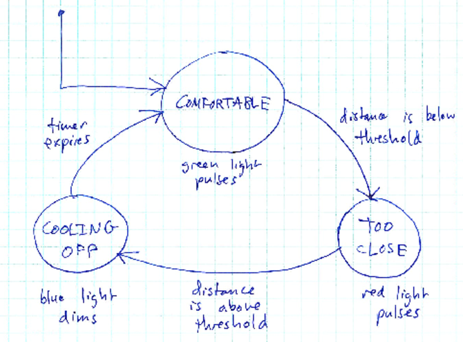

# Learning Goals
* Create finite state machines for simple applications
* Identify events, actions, and states for your prototype
* Translate finite state machines into Processing applications

# What Are Finite State Machines?

A finite state machine is a simple method for describing any responsive system. Each machine consists of three parts: <i>event</i>, <i>actions</i>, <i>states</i>. At a high-level the machine starts in a particular <i>state</i> and while in that <i>state</i> performs certain <i>action(s)</i>. These actions can be external things, such as blinking a light or starting a motor, or can be internal, such as starting a timer/counter. The machine moves between states based upon <i>events</i> that occur. Like <i>actions</i>, these <i>events</i> can be internal, such as that timer going off, or can be external, such as the user pressing a button or coming within range of the sensor.

As an example read the following description below and review the corresponding finite state machine:

><i>Imagine a computer system that gets "annoyed" when people come near. Normally, the system is "comfortable", and flashes green.  If a person gets too close to the system then a proximity sensor detected someone is "too close" and the system reacts by flashing red.  When the proximity increases above the threshold again, the system "cools" off (showing blue until a timer expires) and then returns to the "comfortable" state.</i>

From that description the following state diagram would be created:

> 

What is important about the machine is that it:
* Identifies what should happen in each state 
* What causes it to move between states
* Provides some hints at what sensors or actuators should be used

Your semester projects may be complex and require finite state machines to help you manage what should happen. Following the example below will help you translate your project into Processing code that implements a state machine for your project.

# Translating to Processing

Translating a state machine to Processing is pretty easy. There are three major parts:
* Creating state variables for each state in your digrams
* Implementing that state table
* Writing exec functions that implement that outputs in each state and determine what state should be next. 

## Part 1 - Creating State Variables
First, we make an enumeration from the system states. There should be one state variable for each state in your diagram. Write this code by itself above your `setup()` and `draw()` functions.


enum State {
  COMFORTABLE,
  TOO_CLOSE,
  COOLING_OFF,
}


Next, create a global (visible to all functions) variable to keep track of the current state called `currentState`.


// Variable to keep track of the current state
State currentState = State.COMFORTABLE; // COMFORTABLE is the initial state


## Part 2 - Creating the State Table

After each state variable is created new code should be added in the `draw()` function to make your machine operate. First, a new variable called `nextState` is created holds the future state of your machine. Below the `nextState` variable is a series of <i>case</i> statements that update the `nextState` of your machine based upon the `currentState`. For the example below since there are 3 states, there are 3 case statements: COMFORTABLE, TOO_CLOSE, and COOLING_OFF. These three states are taken directly from the state diagram.


// variable to hold our future state
State nextState;

switch (currentState) {
  case COMFORTABLE:
    // if current state is COMFORTABLE, call its State Function
    nextState = exec_COMFORTABLE();
    break;
  case TOO_CLOSE:
    // if current state is TOO_CLOSE, call its State Function
    nextState = exec_TOO_CLOSE();
    break;
  case COOLING_OFF:
    nextState = exec_COOLING_OFF();
    break;
  default:
    // we're in a bad state. Panic!
    throw new IllegalStateException("Unhandled state: " + currentState);
}

//update current state and advance the machine
currentState = nextState;


In each case statements is an state function for each state. For example, the state function for COMFORTABLE is <i>exec_COMFORTABLE()</i> We will implement these functions in the next stage. However, their purpose is to create any outputs that are required in the state and determine what the next state of the machine should be. Only one state function will be called and that one will be update `nextState`. The final line of the State Table updates `currentState` and forces the machine to repeat.

## Part 3 - Implementing Your State Function
As we saw in the State Table in Part 2, each state is associated with a function.  A state's function has two responsibilities:

1. Generate the outputs for the state
2. Read inputs and switch to another state if appopriate

For each state you will need to write a state function that implements those two abilities. First, your should generate the outputs of your state. Then you should return a `state` variable that tells the State Table what the next state should be. The outputs should be the items below your state in the diagram. The events/transitions in your diagram should determine what the next state should be.

For example, here is the `exec_TOO_CLOSE` function:


State exec_TOO_CLOSE() {
  // Generate outputs
  float x = 2.0;
  float theta = ticks / x;
  float r = ((sin(theta) + 1.0) / 2.0) * 255.0;
  arduino.analogWrite(redPin, (int)r);
  
  // Determine next state. Create a variable to hold it.
  State nextState;
  if (dist <= THRESHOLD) {
    // Stay in TOO_CLOSE state
    nextState = State.TOO_CLOSE;
  } else {
    // Transition to COOLING_OFF state
    nextState = State.COOLING_OFF;
    
    // Turn off red because we're leaving the state
    arduino.analogWrite(redPin, 0);
    
    // Set initial coolingOff counter value.
    coolingOff = COOLING_OFF_TIME;
  }
  
  // Return the next state to the Stat Table
  return nextState;
}


Each state function returns the next system state.  Note that when a function decides to switch to another state, it may need to do some cleanup and/or initialization to get ready for the next state.

# A Full Example Sketch
Here is the complete sketch:

> [InMySpace.pde](https://github.com/ycpcs/fys100-fall2016/blob/gh-pages/labs/InMySpace.pde)
